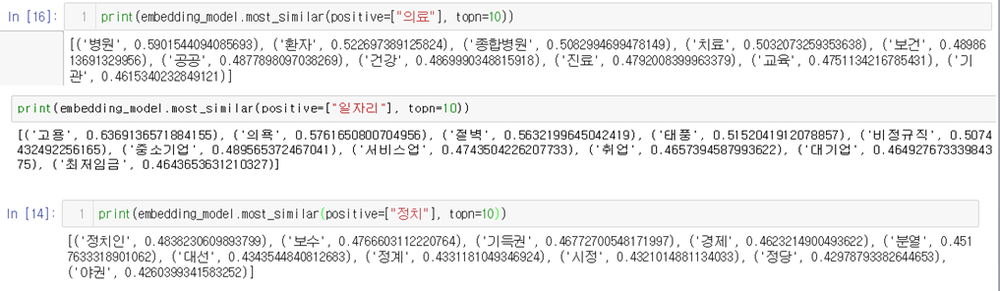
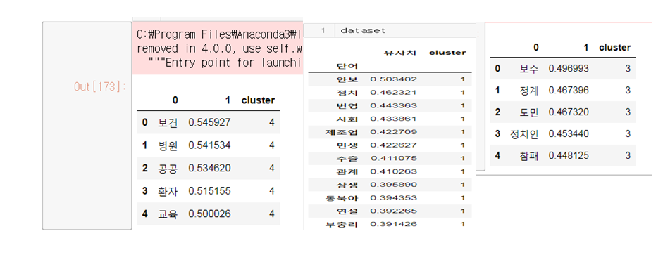
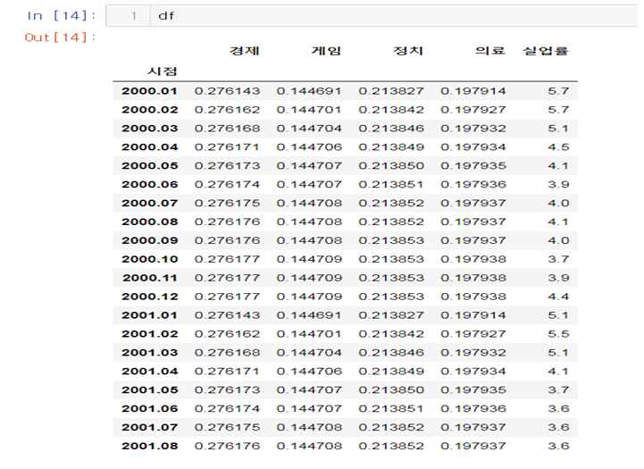
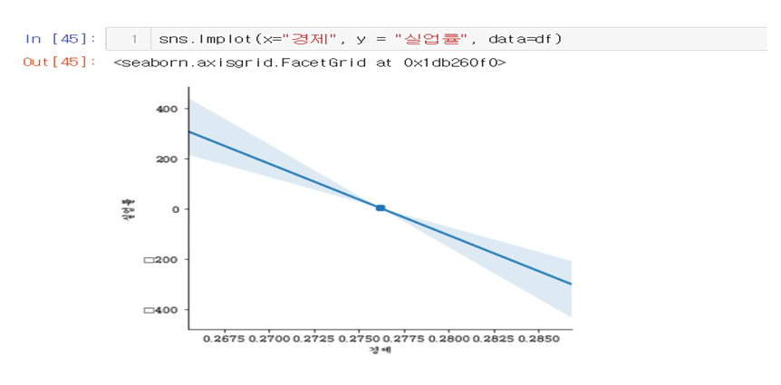
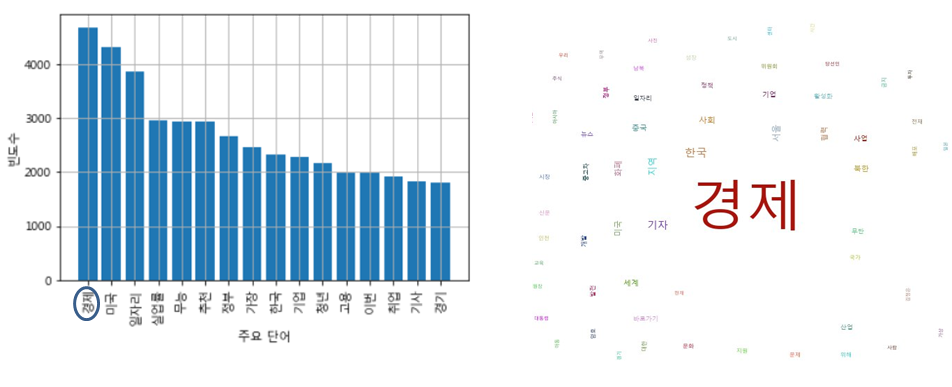

# Bigdata-unemployment-rate-analysis
공공데이터와 뉴스기사 크롤링을 활용한 실업률 분석

# :runner:  
공공(실업률)데이터와 뉴스 기사를 통해 사회이슈가 실업률에 끼치는 영향을 분석해본다.

# 기획 배경
  - 실업에 영향을 끼치는 요소들이 실로 다양(경기후퇴, 산업구조변화, 자발적실업 등)
  - 실업이란 : 일할 능력과 의사가 있음에도 불구하고 일자리를 가지지 못한 상태
  - 매년 실업률이 지속적으로 증가하고 있음
  - 현시점 취업을 앞둔 시점에서 사회적 이슈가 취업 및 실업에 끼치는 영햘 분석
  
# 진행 방향
  - 공공데이터 포털의 실업률 데이터 활용
  - 뉴스기사 크롤링 및 단어 추출
  - word2vec에서 제공하는 most_similar() 함수를 통해 추출한 단어 군집화 
  - 군집과 단어의 빈도수를 통해 수치부여 및 실업률 데이터와 마지(데이터셋 생성)
  - 실업률과 군집간의 상관관계 분석 및 실업률 예측
  
# 군집화
  - word2vec의 most_similar() 함수를 활용한 유사단어 추출

  - 유사단어끼리 군집화

# 데이터 셋
  - 군집에 포함된 단어 수/전체 단어 수 + 실업률 데이터 

# 상관관계 및 분석결과
- 뉴스에 경제 관련 키워드가 증가할수록 실업률 증가

  

